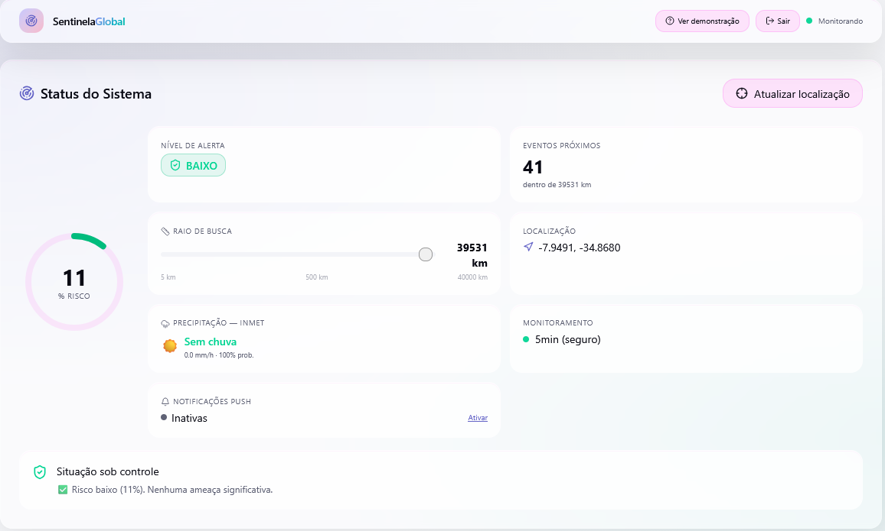
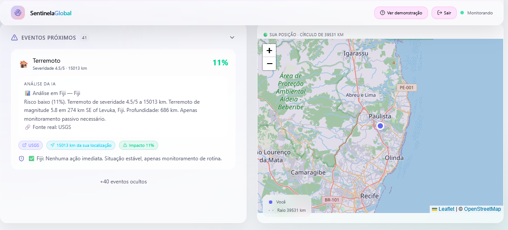
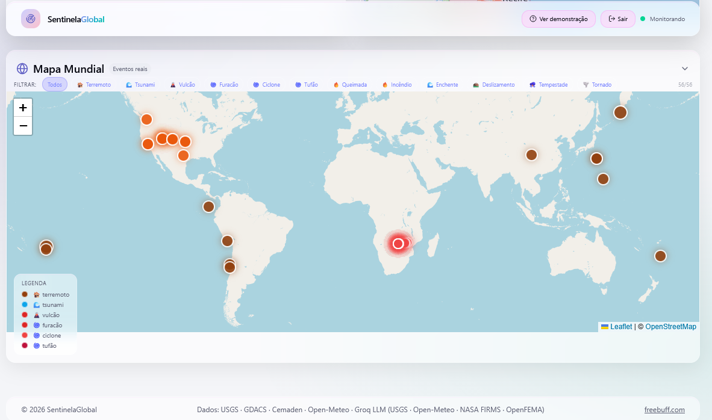
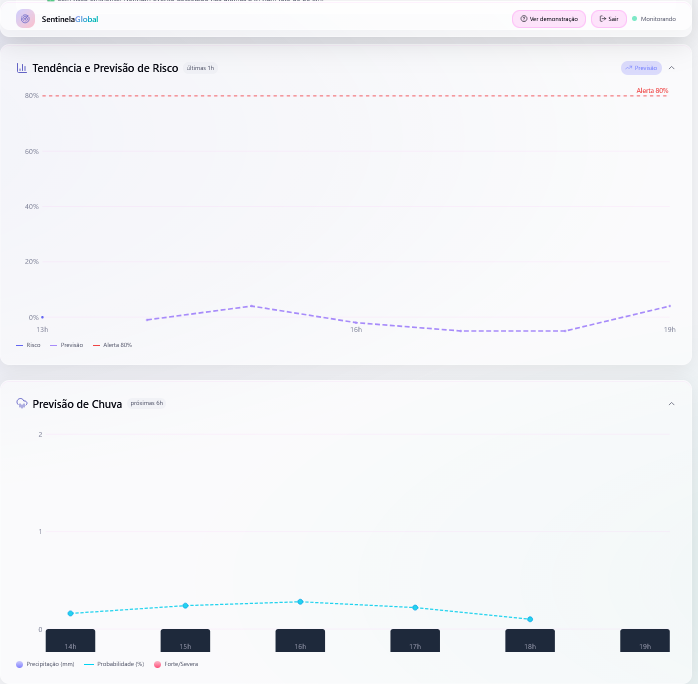
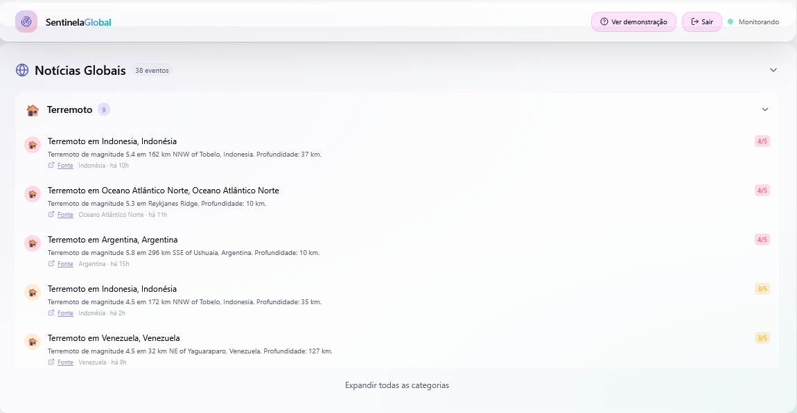
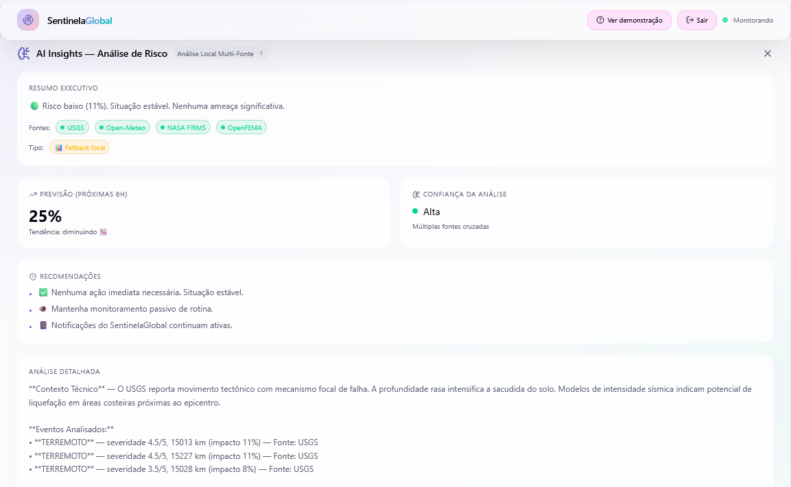
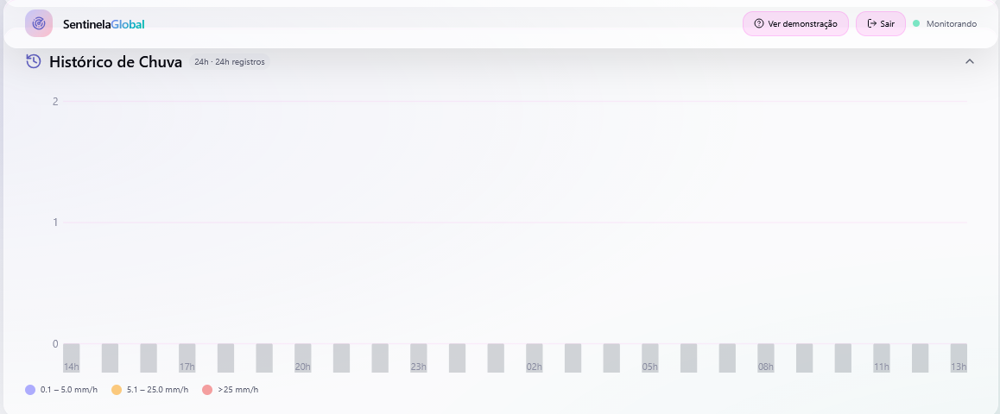

# 🛰️ SentinelaGlobal

**Sistema inteligente de monitoramento de riscos e desastres naturais em tempo real.**

O SentinelaGlobal analisa dados de agências internacionais de desastres (USGS, GDACS, NASA, NOAA, Copernicus, INMET) com IA generativa, calcula o nível de ameaça próximo à sua localização e emite alertas visuais e sonoros quando o risco ultrapassa 80%.

---

## 🧠 Engenharia de IA e Decisões Técnicas

Esta seção detalha o processo de engenharia por trás da integração da IA.

### 1. Arquitetura de LLM

O sistema utiliza uma Pipeline de Inferência Baseada em Eventos:

```
Input (Dados Geoespaciais + Clima)
  → [Cálculo Determinístico (Fator Risco)]
    → [System Prompt com Few-Shot]
      → [Groq API (Llama 3.3 70B)]
        → [Validador de Schema Flexível (PT/EN)]
          → [UI/Dashboard]
```

### 2. Decisões de Engenharia

- **Modelo:** Groq (Llama 3.3 70B). Justificativa: Latência ultrabaixa, essencial para alertas de desastres, aliada a reasoning de alto nível para interpretação de múltiplos datasets.
- **Framework:** Chamadas diretas à API. Justificativa: Priorizamos performance e controle total do payload, evitando abstrações pesadas.
- **Temperatura (0.1):** Minimiza alucinações e garante determinismo técnico em situações de emergência.

### 3. Estratégia de Prompting

Utilizamos Few-Shot Prompting com schema JSON explícito no system prompt, forçando o modelo a retornar campos específicos com valores exatos. O validador aceita tanto nomes em **PT** quanto **EN** (ex: `resumo_executivo` ou `executive_summary`, `recomendacoes` ou `recommendations`).

### 4. Robustez e Resiliência (Circuit Breaker)

- **Validação de Schema Flexível:** Validador manual que busca campos por múltiplos nomes (PT + EN) — `analise_detalhada` é opcional, `tendencia` aceita variações como "aumentando"/"up"/"rising"
- **Cadeia de 3 tentativas:** `freebuff.com.completion()` → `API Groq direta` → `Análise Local` (fallback determinístico)
- **Trava de processamento:** `processandoRef` impede execuções concorrentes do polling
- **Cooldown inteligente:** Se nenhum evento dentro de 30km, pausa requisições por 15min
- **Transparência:** Badges no Dashboard informam a origem (🤖 IA Real / 📊 Fallback Local)

### 5. Proxy Server-Side (CORS)

Todas as APIs externas de monitoramento são consultadas **via Convex Action** (server-side), eliminando completamente os erros de CORS. O navegador só faz fetch direto como fallback para APIs que permitem CORS (USGS, Open-Meteo, NWS, OpenFEMA).

---

## 📋 Índice

- [Funcionalidades](#-funcionalidades)
- [guia de instalação](Instalação.md)
- [Stack Tecnológica](#-stack-tecnológica)
- [Fontes de Dados](#-fontes-de-dados)
- [Páginas do Sistema](#-páginas-do-sistema)
- [Como Usar](#-como-usar)
- [Estrutura do Projeto](#-estrutura-do-projeto)
- [Contribuição](#-contribuição)
- [Licença](#-licença)

---

## 🚀 Funcionalidades

### 🔍 Monitoramento Contínuo
- Análise automática com dados **REAIS** de múltiplas agências internacionais
- Polling dinâmico: **1 minuto** em risco crítico (>80%), **5 minutos** em risco seguro
- Raio de busca ajustável de **5 km a 40.000 km**
- Cálculo de risco baseado em severidade do evento × fator de distância

<p align="center">
  
</p>

### 🗺️ Mapa Interativo (Leaflet)
- Mapa de localização com marcador do usuário
- Círculo de raio de busca ao redor da posição do usuário
- **Mapa Mundial** com todos os eventos globais filtrados por tipo de catástrofe
- Marcadores coloridos por tipo e severidade do evento
- Integração com OpenStreetMap

<p align="center">
  
</p>

<p align="center">
  
</p>

### 📊 Gráficos SVG (zero dependências externas)
- **Gráfico de Tendência de Risco** — histórico horário com previsão para próximas 6h
- **Previsão de Chuva** — precipitação prevista para as próximas 6 horas com probabilidade
- **Histórico de Chuva 24h** — barras de precipitação das últimas 24 horas
- Linha de alerta 80% com destaque visual

<p align="center">
  
</p>

### 🌍 Notícias Globais por Catástrofe
- Agrupamento por **16 tipos de catástrofe**: terremoto, tsunami, vulcão, furacão, ciclone, tufão, queimada, incêndio, enchente, deslizamento, tempestade, tornado, seca, nevasca, onda de calor, monção
- Cada categoria com expandir/recolher: **5 itens recolhido / 15 expandido**
- Categorias sem eventos mostram *"Sem atividade registrada"*
- Links diretos para fonte original (USGS, GDACS, NASA FIRMS)

<p align="center">
  
</p>

### 🤖 AI Insights (Análise com IA)
- Resumo executivo do cenário de risco
- Análise detalhada com contexto técnico multi-fonte
- Recomendações específicas baseadas no nível de risco
- Tendência: aumentando 📈 / estabilizando 📊 / diminuindo 📉
- Nível de confiança da análise (alta / média / baixa)
- **Cadeia de tentativas**: freebuff.com.completion() → Groq API direta → Análise local simulada

<p align="center">
  
</p>

### 🌧️ Alerta de Chuva (Classificação INMET)
- Classificação oficial INMET: Fraca (0.1–5.0 mm/h), Moderada (5.1–25.0), Forte (25.1–50.0), Severa (50.1–100.0), Extrema (>100.0)
- Classificação por código WMO (World Meteorological Organization)
- Classificação combinada (intensidade + código WMO)
- Fontes: INMET, Open-Meteo, OpenWeatherMap, WeatherAPI

<p align="center">
  
</p>

### 🔔 Notificações Push
- Notificações críticas quando risco > 80%
- **Som de alerta** via Web Audio API (oscilador duplo)
- **Vibração** em dispositivos móveis
- Ação "Ver mapa" na notificação
- Badge com contador de novos alertas


### 🎯 Eventos Próximos
- Lista detalhada com severidade, distância e impacto percentual
- Análise gerada por IA para cada evento
- Badges: fonte do dado, distância da localização, impacto
- Cores por nível: verde (baixo), âmbar (moderado), laranja (alto), rosa (crítico)

### 📍 Geolocalização
- Solicitação de localização ao carregar
- Botão "Atualizar localização"
- Precisão alta com timeout de 10s

---

## 🛠️ Stack Tecnológica

| Categoria | Tecnologia |
|-----------|-----------|
| **Frontend** | React 19, TypeScript, Vite 7 |
| **Roteamento** | React Router 7 |
| **Estilos** | Tailwind CSS 4, shadcn/ui, Framer Motion |
| **Mapas** | Leaflet + react-leaflet |
| **Backend/Database** | Convex (realtime queries, mutations) |
| **Autenticação** | Convex Auth (Google OAuth, anônimo) |
| **IA/LLM** | freebuff.com.completion (Groq + Llama 3), API Groq direta, fallback local |
| **Ícones** | Lucide React |
| **Gráficos** | SVG puro (zero dependências externas) |
| **Pacotes** | Bun |

---

## 🌐 Fontes de Dados

O sistema consulta **13 fontes** de dados em paralelo:

| Fonte | Dados | Chave |
|-------|-------|-------|
| [USGS](https://earthquake.usgs.gov) | Terremotos (magnitude ≥ 4.5, últimas 24h) | ❌ Gratuita |
| [GDACS](https://www.gdacs.org) | Desastres globais (ciclones, enchentes, vulcões, incêndios) | ❌ Gratuita |
| [EMSC](https://www.seismicportal.eu) | Terremotos (fallback europeu) | ❌ Gratuita |
| [NASA FIRMS](https://firms.modaps.eosdis.nasa.gov) | Queimadas ativas (VIIRS, mundo todo) | ✅ Requer chave gratuita |
| [USGS Volcano](https://volcanoes.usgs.gov) | Alertas vulcânicos | ❌ Gratuita |
| [NOAA NHC](https://www.nhc.noaa.gov) | Furacões e tempestades tropicais (Atlântico) | ❌ Gratuita |
| [Open-Meteo](https://open-meteo.com) | Meteorologia (temperatura, chuva, vento, previsão 6h, histórico 24h) | ❌ Gratuita |
| [NOAA NWS](https://www.weather.gov) | Alertas de tsunami | ❌ Gratuita |
| [OpenFEMA](https://www.fema.gov) | Desastres nos EUA (incêndios, furacões, enchentes) | ❌ Gratuita |
| [Copernicus EMS](https://emergency.copernicus.eu) | Queimadas, enchentes e tempestades (Europa/mundo) | ❌ Gratuita |
| [Cemaden](http://www.cemaden.gov.br) | Estações pluviométricas (Brasil - APAC PE) | ❌ Gratuita |
| [INMET](https://apitempo.inmet.gov.br) | Estações meteorológicas automáticas (Brasil) | ❌ Gratuita |
| [OpenWeatherMap](https://openweathermap.org) | Meteorologia (fallback) | ✅ Requer chave gratuita |
| [WeatherAPI](https://www.weatherapi.com) | Meteorologia (fallback) | ✅ Requer chave gratuita |
| [Nominatim (OSM)](https://nominatim.openstreetmap.org) | Reverse geocoding (nome do local por coordenadas) | ❌ Gratuita (com rate limit) |

**Sistema de fallback em cadeia**: Se a fonte primária falha, a secundária é tentada automaticamente. Exemplo:
- Terremotos: USGS → EMSC
- Queimadas: NASA FIRMS → Copernicus EMS
- Vulcões: USGS Volcano → GDACS
- Precipitação: INMET → Open-Meteo → OpenWeatherMap → WeatherAPI

---

## 📄 Páginas do Sistema

### `/` — Landing Page
Página inicial com:
- Hero com gradiente e call-to-action
- 3 cards de funcionalidades (Monitoramento Contínuo, Mapa Interativo, Alertas Inteligentes)
- Seção de fontes de dados confiáveis
- Botões: "Iniciar monitoramento" e "Ver demonstração"

### `/dashboard` — SentinelaDashboard (Principal)
Painel completo de monitoramento:
- **Status do Sistema**: círculo de risco, nível de alerta, eventos próximos, raio de busca ajustável, localização, precipitação INMET, monitoramento, notificações push
- **Tendência e Previsão de Risco**: gráfico SVG com histórico + previsão 6h
- **Previsão de Chuva**: gráfico de barras SVG com probabilidade (próximas 6h)
- **Histórico de Chuva 24h**: gráfico de barras SVG
- **AI Insights**: análise completa com LLM (resumo, recomendações, tendência, confiança)
- **Notícias Globais**: agrupadas por 16 tipos de catástrofe com expandir/recolher
- **Eventos Próximos**: lista detalhada com análise e recomendações
- **Mapa Local**: Leaflet com marcador do usuário e círculo de busca
- **Mapa Mundial**: todos os eventos globais com filtro por tipo

### `/auth` — Autenticação
- Login com Google OAuth
- Entrada como convidado (anônimo)

### `/apoiar` — Apoie o Projeto
- Página de contribuição via PIX
- QR Code dinâmico
- Chave PIX (UUID) com botão copiar
- Valores sugeridos: Café (R$5), Apoiador (R$10), Destaque (R$25), Impulsionar (R$50)

---

## 📖 Como Usar

### 1. Acessar o Sistema
Abra o SentinelaGlobal no navegador. Na landing page, clique em **"Iniciar monitoramento"**.

### 2. Permitir Localização
O navegador solicitará permissão de localização. **Permita o acesso** para que o sistema possa:
- Calcular riscos de eventos próximos
- Mostrar sua posição no mapa
- Exibir eventos dentro do raio de busca

### 3. Monitorar Riscos
O sistema automaticamente:
- Busca dados de todas as APIs em paralelo
- Calcula o risco com base em severidade × distância
- Gera análise detalhada com IA
- Mostra eventos, notícias e mapas

### 4. Configurar Alertas
- Ajuste o **raio de busca** (5 km a 40.000 km) para controlar a área monitorada
- Ative **notificações push** para receber alertas críticos
- O polling automático ajusta a frequência: 1 min (crítico) / 5 min (seguro)

---

## 📁 Estrutura do Projeto

```
src/
├── components/ui/       # Componentes shadcn/ui reutilizáveis
├── convex/
│   ├── auth/            # Provedores de autenticação
│   ├── auth.config.ts   # Configuração de auth
│   ├── auth.ts          # Convex Auth (Google + anônimo)
│   ├── http.ts          # HTTP endpoints
│   ├── monitoramento.ts # Queries e mutations de risco
│   ├── schema.ts        # Schema do banco Convex
│   └── users.ts         # Helper de usuário atual
├── hooks/
│   ├── use-auth.ts      # Hook de autenticação
│   └── use-mobile.ts    # Hook de detecção mobile
├── lib/
│   ├── alerta-chuva.ts  # Classificação INMET e alertas de chuva
│   ├── api-mundiais.ts  # Integração com APIs de desastres (15+ fontes)
│   ├── llm-service.ts   # Análise com LLM (freebuff → Groq → fallback)
│   ├── risco-local.ts   # Cálculo de risco, previsão, análise
│   ├── utils.ts         # Utilitários gerais
│   └── vly-integrations.ts # Configuração VLY
├── pages/
│   ├── Landing.tsx      # Página inicial
│   ├── SentinelaDashboard.tsx  # Painel principal (107 KB)
│   ├── Auth.tsx         # Página de login
│   ├── Apoiar.tsx       # Página de contribuição PIX
│   └── NotFound.tsx     # Página 404
├── index.css            # Estilos globais + Tailwind
├── instrumentation.tsx  # Instrumentação
└── main.tsx             # Entry point + rotas
```

---

## ⚙️ Variáveis de Ambiente

| Variável | Descrição | Obrigatória |
|----------|-----------|-------------|
| `VITE_CONVEX_URL` | URL do deployment Convex | ✅ Sim |
| `VITE_NASA_FIRMS_KEY` | Chave gratuita NASA FIRMS | ❌ (opcional, sem ela queimadas não carregam) |
| `VITE_OWM_KEY` | Chave gratuita OpenWeatherMap | ❌ (fallback Open-Meteo) |
| `VITE_WEATHERAPI_KEY` | Chave gratuita WeatherAPI | ❌ (fallback Open-Meteo) |
| `VITE_GROQ_API_KEY` | Chave Groq para LLM | ❌ (fallback local) |

---

## 🤝 Contribuição

Contribuições são bem-vindas! Áreas que podem ser melhoradas:

- **Mais fontes de dados**: integração com agências da Ásia, África e Oceania
- **Previsão estendida**: modelos de machine learning para previsão de risco
- **App mobile**: versão PWA ou React Native
- **Traduções**: suporte a mais idiomas
- **Histórico persistente**: salvar análises no Convex para consulta posterior

---

## 📜 Licença

Projeto gratuito e open source. Desenvolvido com React, Convex, Tailwind CSS e integrações VLY.

---

<p align="center">
  Feito com ❤️ para ajudar comunidades a se prepararem para desastres naturais.
</p>
