### 5. Uso Efetivo do Agente de Codificação

| Critério |
|----------|
|Evidência clara de uso extensivo do agente (menção de prompts usados, logs ou screenshots, iterações). Demonstra que a maior parte do código foi gerada pelo agente com supervisão do estudante |

### Tela inicial do terminal Freebuff, exibindo o status de uso das sessões diárias e a seleção de modelos de IA disponíveis para codificação.

---

  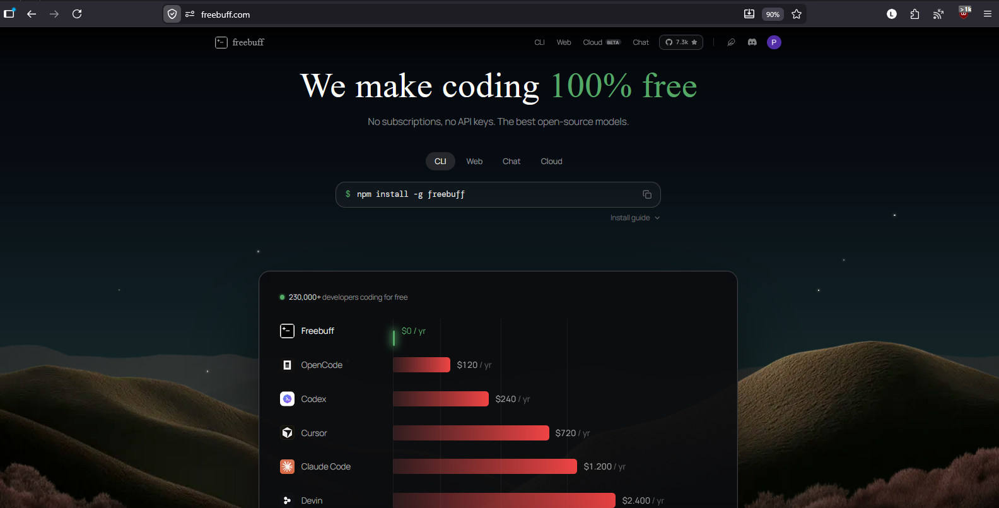

---

### Página web do Freebuff destacando a proposta de gratuidade da ferramenta comparada a outras soluções de mercado para desenvolvedores.

---

  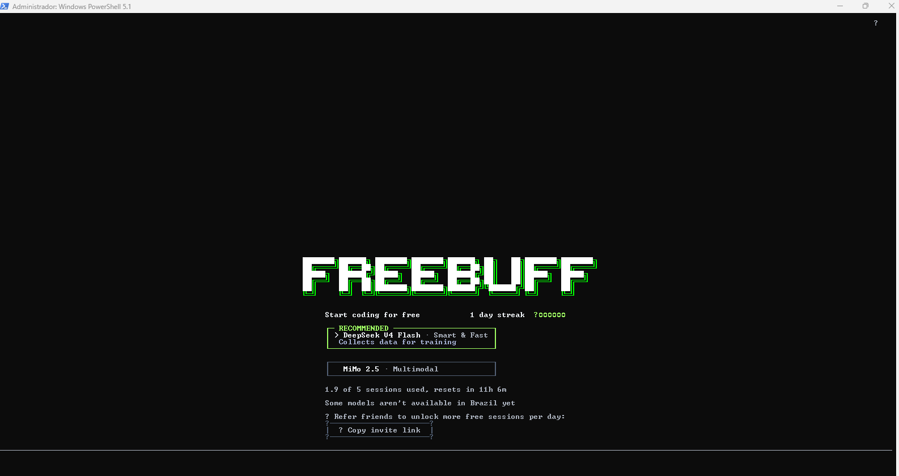

---

### Painel de monitoramento de recursos no Convex, mostrando métricas de uso de CPU, memória e chamadas de função para o projeto.

---

  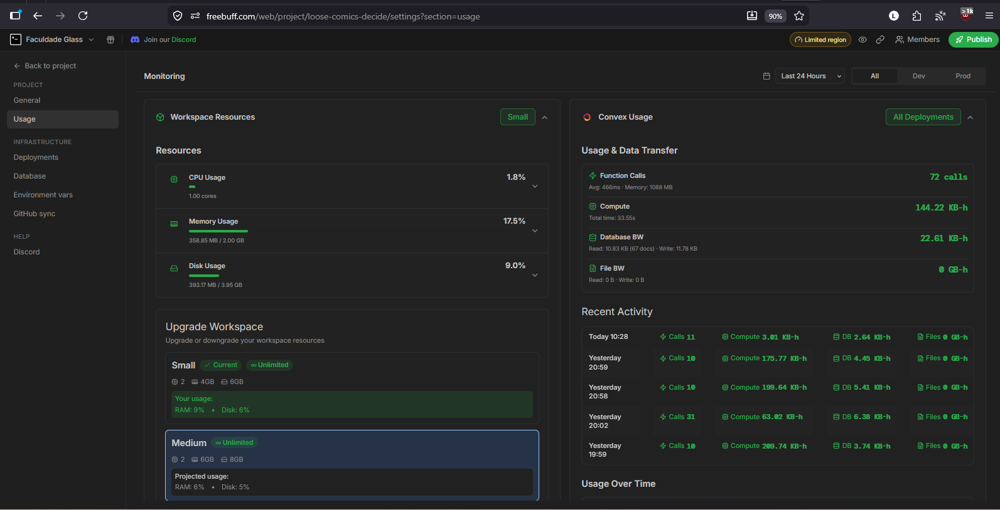

---

### Configurações de credenciais de IA no Freebuff, onde o usuário pode integrar chaves de API da OpenAI (Codex) ou Anthropic (Claude Code).

---

  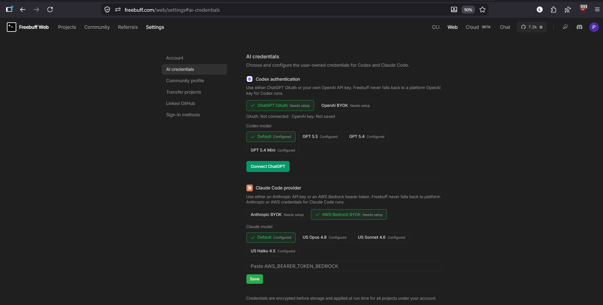

---

### Interface do usuário do Sentinela Global já integrada, exibindo o fluxo de análise de dados com IA e a estrutura visual da plataforma de monitoramento.

---

  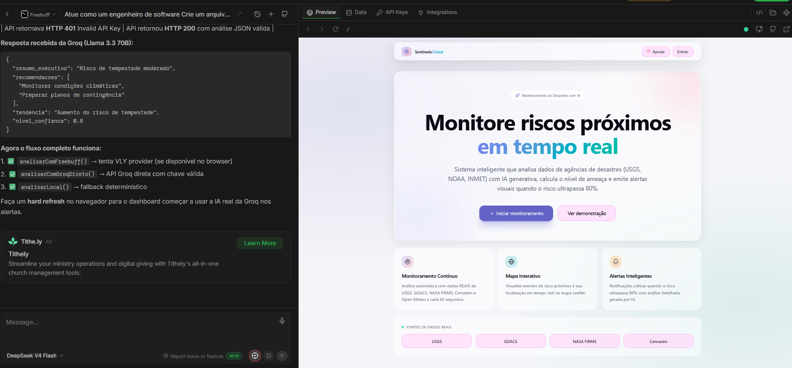

---

### Início do projeto Sentinela Global, definindo a arquitetura (React, Vite, Node.js) e planejando a estrutura de pastas e funcionalidades principais.

---

  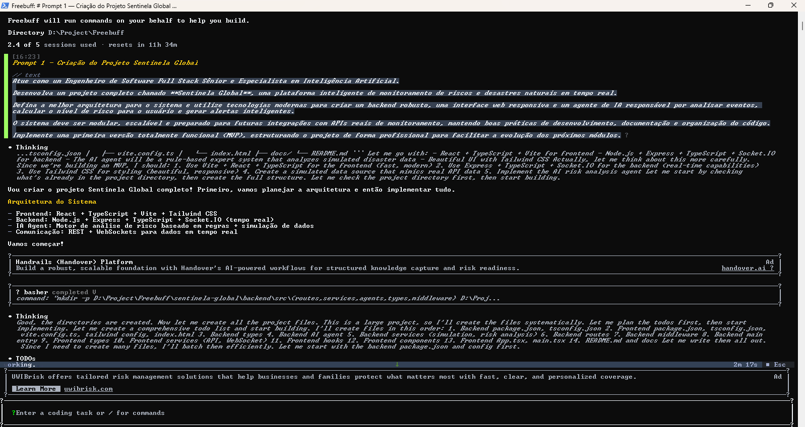

---

### Detalhamento da execução do plano de trabalho, onde o agente está criando em lote os arquivos essenciais de configuração e estrutura do backend (como package.json,tsconfig.json e .env.example) para o projeto Sentinela Global.

---

  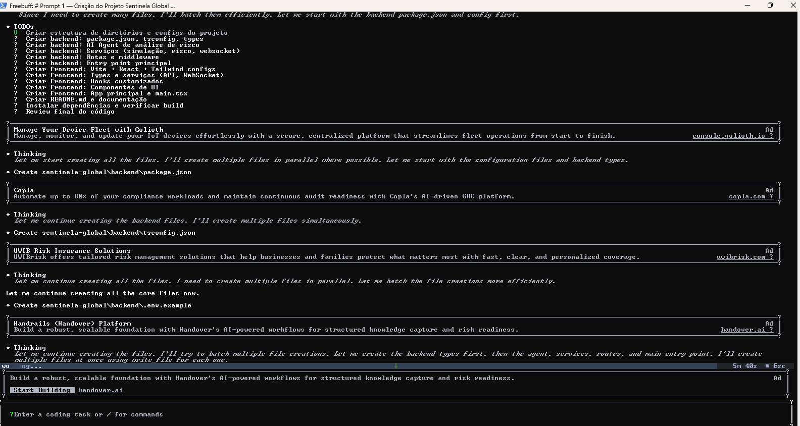

---

###  Revisão de código realizada pelo agente, identificando problemas críticos como require dinâmico e falhas na lógica de filtragem de eventos no Dashboard.

---

  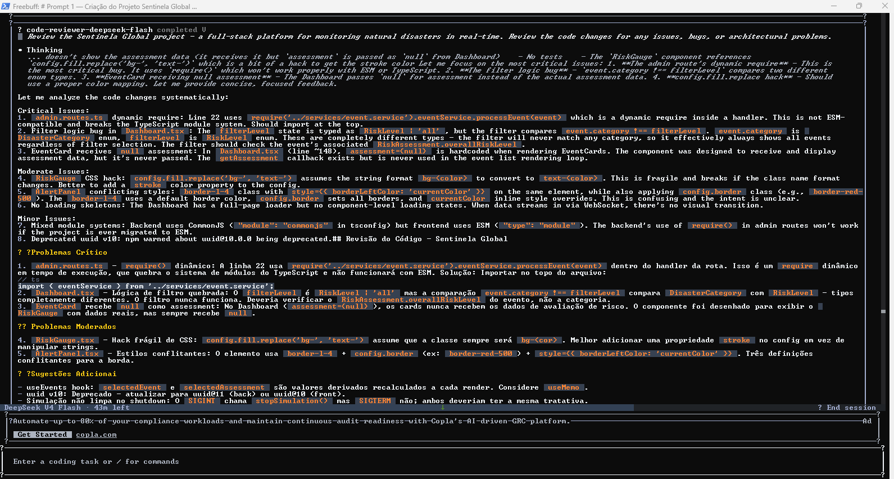

---

### Resumo da entrega final do projeto, listando os componentes implementados no backend e frontend e os comandos necessários para rodar a aplicação localmente.

---

  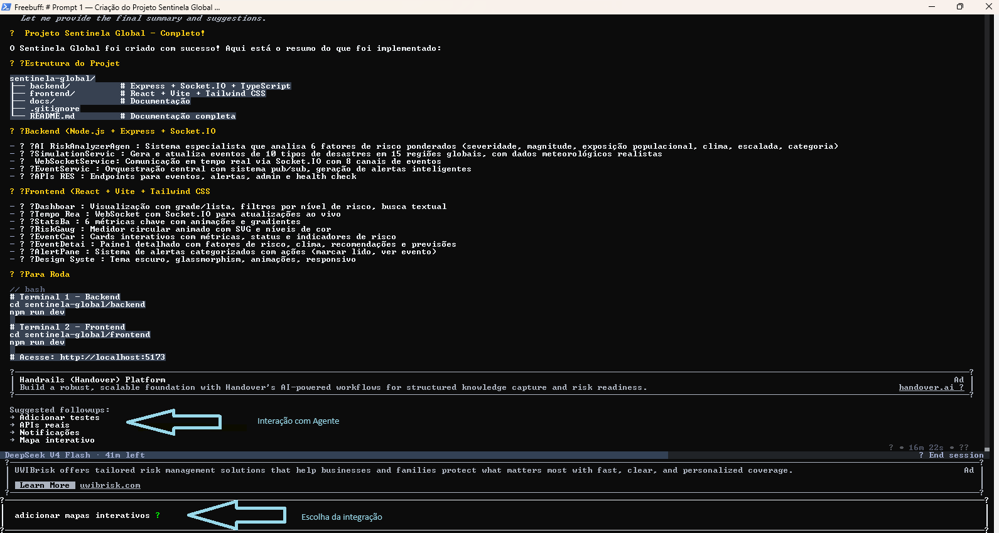

---

### Planejamento e instalação de dependências (Leaflet) para a adição de mapas interativos ao projeto, com integração de marcadores geográficos.

---

  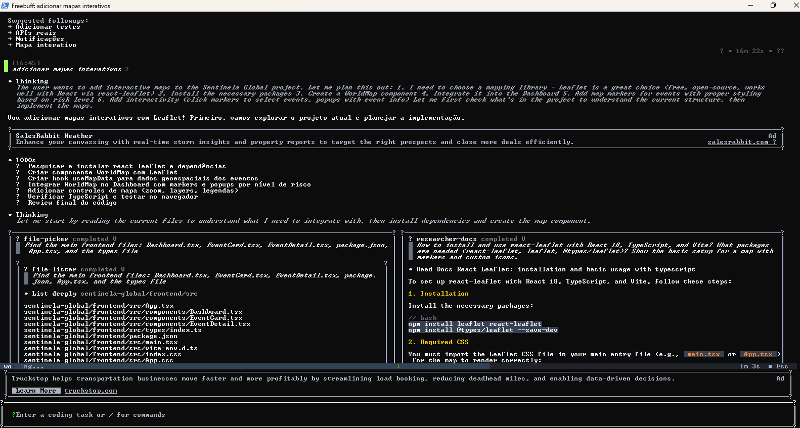

---

### Finalização da integração do mapa interativo, detalhando funcionalidades como tema escuro, indicadores de risco pulsantes e filtros sincronizados com o dashboard.

---

  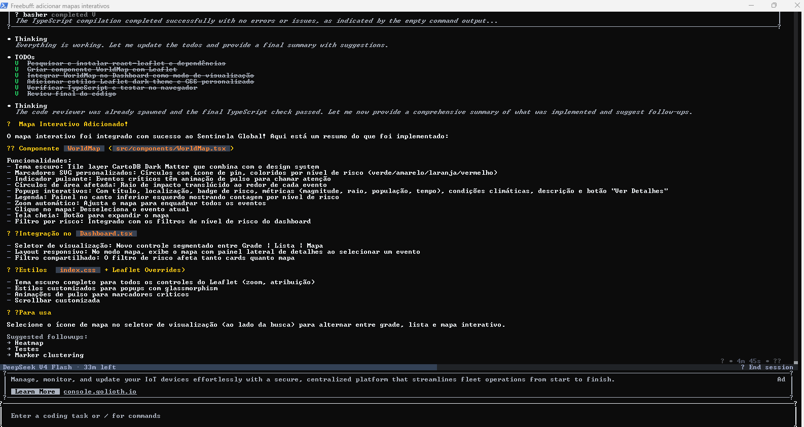

---

